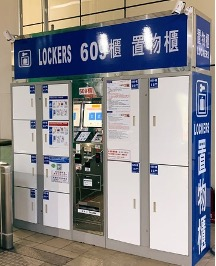
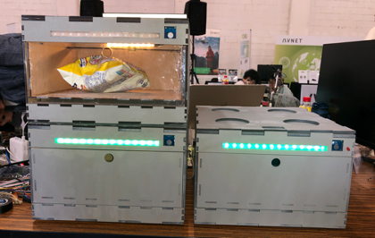
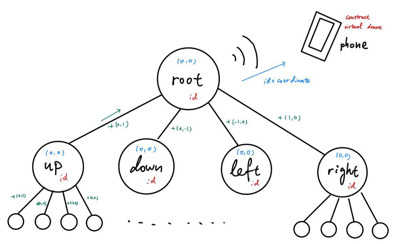
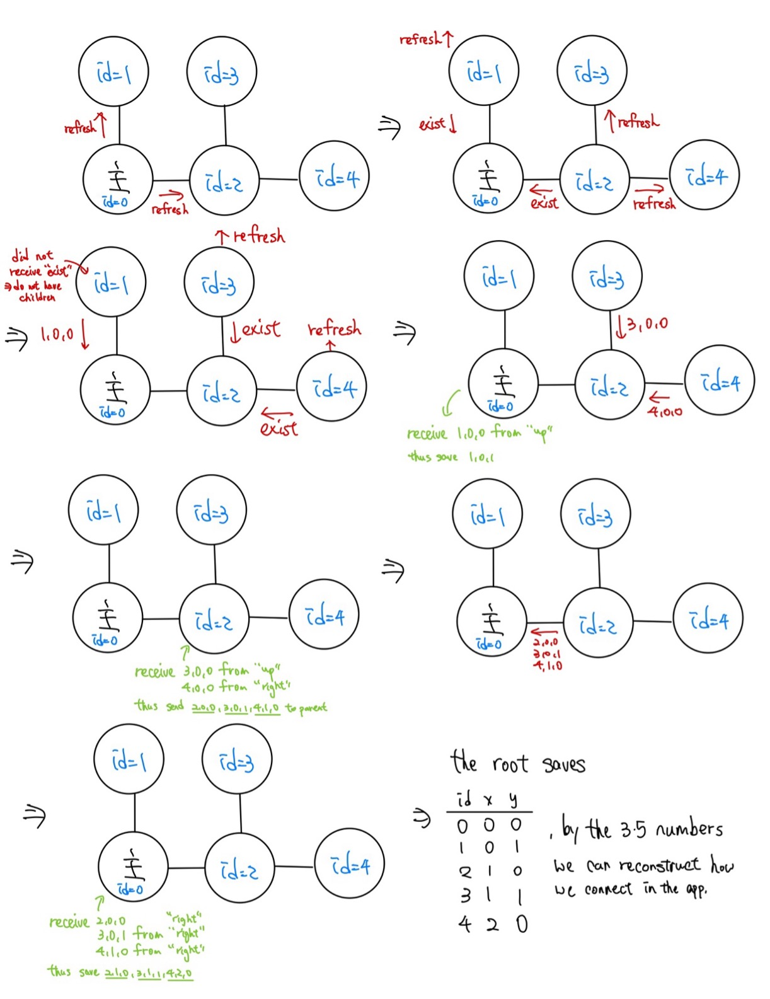

# Algorithm DIY
B10901176 蔡弘祥 Hung Shiang Tsai

## 1. Introduction

This year, 2023, I participated in the MakeNTU competition organized by our department, and our team's theme was the smart storage cabinet. Frequent MRT users may have noticed the lockers placed in some areas within the MRT stations. These lockers consist of a central main unit connected to multiple lockers on either side, with the main unit handling payment, storage, retrieval, and unlocking services. Our concept is somewhat similar to the MRT station lockers but scaled down and with modular features emphasized. Since it's for private use, we removed the troublesome payment system and most of the human-machine interface on the lockers, integrating most functionalities into an app, and making the main unit an independent cabinet.

## 2. Design Concept and Features

While making this cabinet, we aimed to achieve several differentiated features compared to market storage cabinets (for a quick overview, see the demo video in the appendix), including:

1. **IoT integrated app** for effective item management, tagging, and searching.
2. **Independent locking feature** to protect valuable and private items.
3. **External indicator lights** to help users quickly locate the target locker.
4. **Internal lighting** to provide adequate brightness when retrieving items.
5. **Modular design**, allowing flexible arrangement of lockers, with the app automatically generating the placement status.
6. **Special linking structure**, enabling easy assembly of multiple locker sets, which is both aesthetic and orderly.

  

    
    
Locker

  

  

    
    
Demo Model

  

## 3. Algorithm

To reduce costs, we used only one network-enabled development board (Rpi) placed in the main cabinet for the finished product, with other sub-cabinets equipped only with stm32 (due to an enterprise award) or Arduino. This setup posed a problem: how to let the main cabinet with networking capabilities recognize the positions of all connected sub-cabinets so that the app can generate a virtual connection state of the lockers?

For the physical connection and communication between lockers, we currently use small holes in four directions of the cabinet to allow transmission lines to pass through, and the communication protocol uses UART. We implemented connections through the four UART interfaces on Arduino Mega, defining the connections as follows: 0 downward, 1 upward, 2 leftward, and 3 rightward. This means the left cabinet communicates through the 3rd UART interface, and the right cabinet through the 2nd UART interface. Each sub-cabinet thus has a unique path to the main cabinet, simplifying our problem.

Knowing that each sub-cabinet has a unique path to the main cabinet is highly beneficial and simplifies the problem considerably. To bind the cabinets with the stored items, we assigned each cabinet a fixed ID for management purposes. Each time a user connects to a cabinet, the main unit is instructed to rescan all connected sub-cabinets by sending a refresh command through the four UART interfaces. If a sub-cabinet receives a refresh command from a specific UART interface, it defines that interface as the parent and returns an "exist" signal indicating that this direction has children. It then continues to send the refresh command through the remaining three interfaces to search further.

If a direction's child has no further children, it returns three numbers: (my_id,0,0), where the first number represents its my_id, and the second and third numbers represent its coordinates (0,0). Sub-cabinets with children but no grandchildren shift their coordinates and return (child_id,shifted_x,shifted_y) and (my_i,0,0) to the parent. Each sub-cabinet then waits to receive and integrate information from its children before returning it to the parent.

Below are the graphs for nodes connection and signals transmission.

  

    
    
nodes connection

  

  

    
    
signals transmission

  

## 4. Future Prospects

When designing this cabinet, we considered many better solutions, but due to limited technical capability and short implementation time, we compromised on the final product mentioned above. Here are areas we hope to improve:

1. **Different-sized sub-cabinets**
   - Assuming the main cabinet size is 1\*1, we hope to design 1\*2 and 2\*1 sized cabinets in the future, allowing more flexible assembly. However, this requires redesigning the algorithm and CAD drawings for compatibility with different sizes.
2. **Contact-based connection**
   - Currently, each cabinet has an independent power source and three easily damaged Dupont lines (Tx, Rx, Ground) for each direction, totaling 12 lines, which is not user-friendly. We aim to have four metal contact points (including power) in each direction, enabling direct communication and power supply without worrying about line connections.
3. **User login mechanism**
   - Currently, the cabinet can only be used by one user, as anyone with the main cabinet's IP address can unlock it. We hope to add a user mechanism, allowing different family members to have different accounts and unlock or search only their items.
4. **Main cabinet search method**
   - The current connection between the main unit and the app is not user-friendly, requiring the IP address of the Rpi within the local network. We aim to allow users to search for nearby main units upon opening the app and set up the main unit with one click.

## 5. Appendix

1. [locker.jpg source](https://www.google.com/url?sa=i&url=https%3A%2F%2Ffoursquare.com%2Fv%2F%25E6%258D%25B7%25E9%2581%258B%25E6%2596%25B0%25E5%25BA%2597%25E7%25AB%2599%25E7%25BD%25AE%25E7%2589%25A9%25E6%25AB%2583609%25E6%25AB%2583%2F5f20d21267564371a98fff9f&psig=AOvVaw3nSrWaY)
2. [MakeNTU Demo video](https://youtu.be/omlbDYppHjc)

## Arduino child connection pin
* 2: shine (照明)
* 3: LED (提示)
* 4: cts (觸控input)
* 5: servo